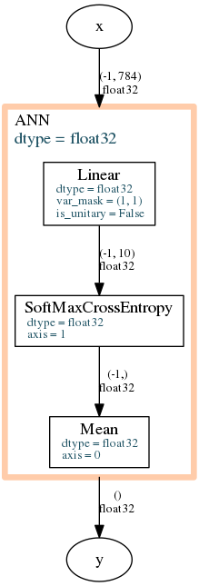

.. _tutorial:

Tutorial
========

.. toctree::
   :maxdepth: 2	

Getting started
---------------

To start using Layers, simply

`clone/download <https://159.226.35.226/jgliu/PoorNN.git>`_ this repo and run

.. code-block:: bash

    $ cd PoorNN/
    $ pip install -r requirements.txt
    $ python setup.py install

Layers is built on a high-performance Fortran 90 code. Please install *lapack*/*mkl* and *gfortran*/*ifort* before running above installation.

Construct a first feed forward network
-----------------------------------------

.. literalinclude:: ../examples/mnist_simple.py

You will get a terminal output 

.. code-block:: none

    <ANN|s>: (-1, 784)|s -> ()|s
        <Linear|s>: (-1, 784)|s -> (-1, 10)|s
          - var_mask = (1, 1)
          - is_unitary = False
        <SoftMaxCrossEntropy|s>: (-1, 10)|s -> (-1,)|s
          - axis = 1
        <Mean|s>: (-1,)|s -> ()|s
          - axis = 0

and an illustration of network stored in :data:`./mnist_simple.png`, it looks like

where the shape and type of data flow is marked on lines, and operations are boxes.

.. note::

    However, the above example raises a lib not found error if you don't have
    `pygraphviz` installed on your host. It is strongly recommended to try out
    `pygraphviz <http://pygraphviz.github.io/documentation/pygraphviz-1.4rc1/tutorial.html#start-up>`_.

Ideology
--------------------------
First, what is a :class:`Layer`?

:class:`Layers` is an abstract class (or interface), which defines a protocal.
This protocal specifies

* **Interface information**, namely :data:`input_shape`, :data:`output_shape`, :data:`itype`, :data:`otype` and :data:`dtype`,
  where :data:`dtype` is the type of variables in this network and :data:`itype`, :data:`otype` are input and output array data type.
* **Data flow manipulation methods**, namely :meth:`forward` and :meth:`backward`.
  :meth:`forward` perform action :math:`y=f(x)` and output :math:`y`, with :math:`f` defines the functionality of this network.
  :meth:`backward` perform action :math:`(x,y),\frac{\partial J}{\partial y}\to\frac{\partial J}{\partial w},\frac{\partial J}{\partial x}`,
  where :math:`J` and :math:`w` are target cost and layer variables respectively.
  :math:`x` and :math:`y` are always required as a unified interface (benefits network design),
  usally they are generated during a forward run.
* **Variable getter and setter**, namely :meth:`get_variables`, :meth:`set_variables`, :data:`num_variables` (as property) and :meth:`set_runtime_vars`.
  :meth:`get_variables` always return a 1D array of length :data:`num_variables` and `set_variables` take such an array as input.
  Also, a layer can take runtime variables (which should be specidied in `tags`, see bellow),
  like a :data:`seed` in order to take a control over a :class:`DropOut` layer.
  These getter and setter are required because we need a unified interface to access variables but not to make variables unreadable in a layer realization.
  Notice that reshape in numpy does not change array storage, so don't worry about performance.
* **Tags (optional)**, :data:`tags` attribute defines some additional property of a layer, which is an optional dict type variable which belongs to a class.
  So far, these properties includes 'runtimes' (list), 'is_inplace' (bool) and 'analytical' (int), see :data:`poornn.core.TAG_LIST` for details.
  If :data:`tags` is not defined, layer use :data:`poornn.core.DEFAULT_TAGS` as a default tags.

Any object satisfing the above protocal can be used as a :class:`Layer`. An immediate benefit is that it can be tested.
e.g. numerical differenciation test using :func:`poornn.checks.check_numdiff`.

Through running the above example, we notice the following facts:

#. Layers take numpy array as inputs and generates array outputs (notice what :func:`typed_randn` also generates numpy array).
#. Network :class:`ANN` is a subclass of :class:`Layer`, it realizes all the interfaces claimed in :class:`Layer`,
   it is a kind of simplest vertical :class:`Container`.
   Here, :class:`Container` is a special kind of :class:`Layer`, it take other layers as its entity and has not independant functionality.
   Containers can be nested, chained, ... to realize complex networks.
#. :data:`-1` is used as a placeholder in a shape, however, using more than 1 place holder in one shape tuple is not recommended, it raises error during reshaping.
#. Anytime, a :class:`Layer` take :data:`input_shape` and :data:`itype` as first 2 parameters to initialize, even it is not needed!
   However, you can ommit it by using :meth:`add_layer` method of :class:`ANN` and :class:`PrallelNN` network when you are trying to add a layer to existing network.
   :meth:`add_layer` can infer input shape and data type from previous layers, appearantly it fails when there is no layers in a container.
   Then you should use :meth:`net.layers.append` to add a first layer, or give at least one layer when initialing a container.

.. note::

    In linear layers, fortran ('F') ordered weights and inputs are used by default.
